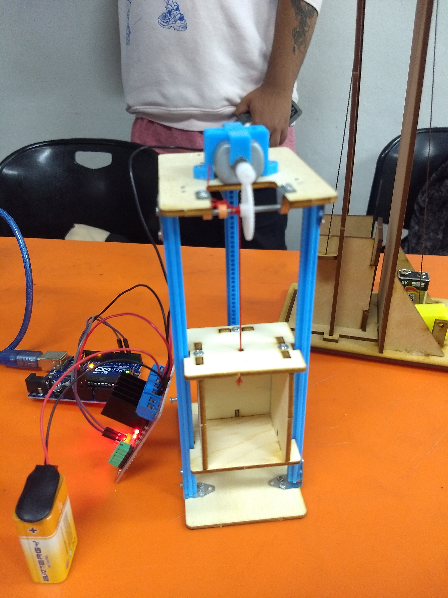
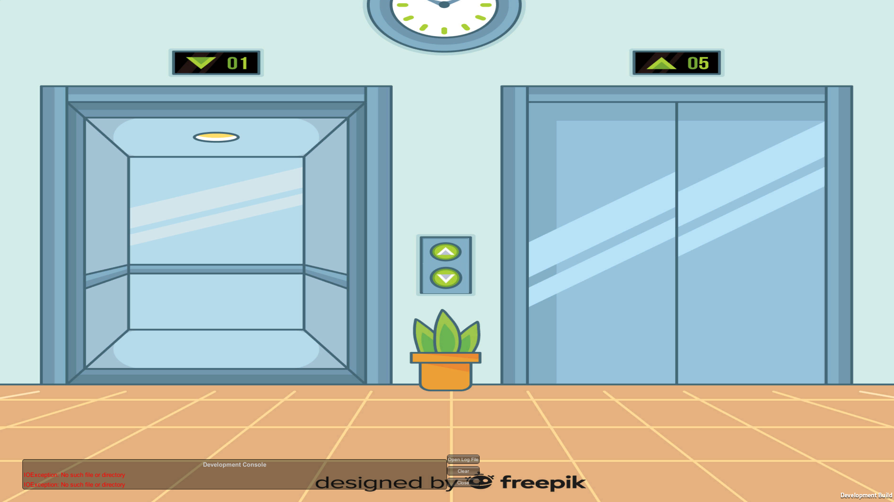
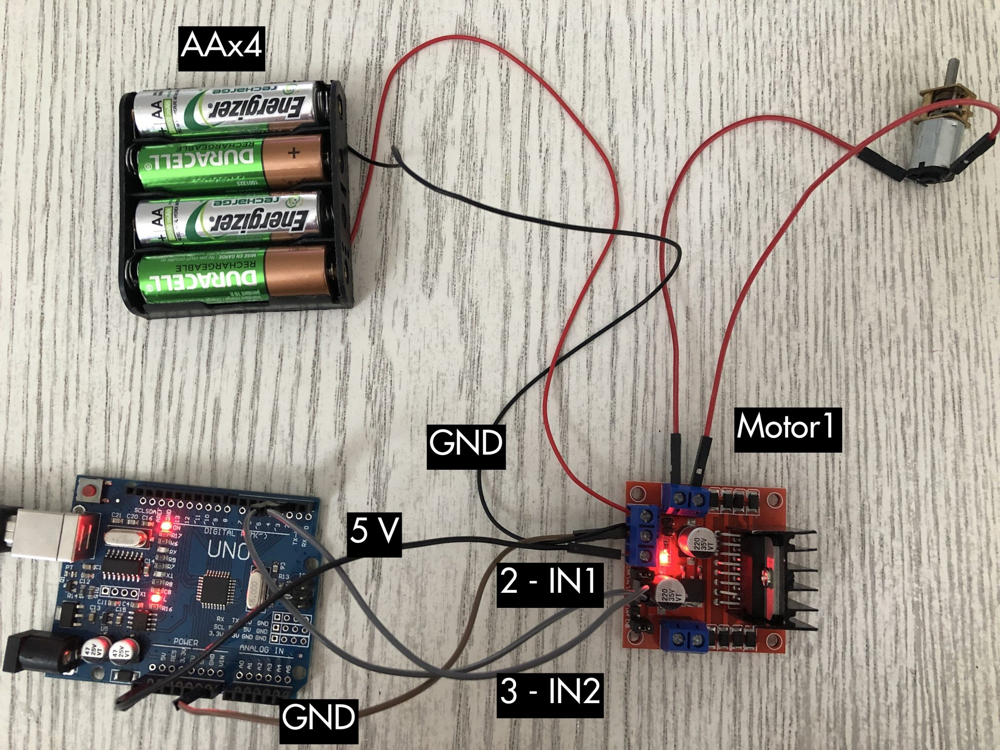
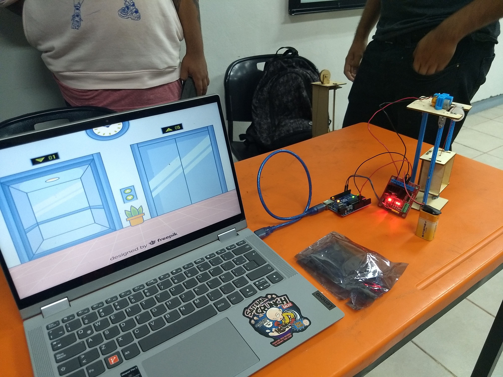

# Elevador Arduino + Software Unity

> basado en el tutorial de [Automatización para Todos](https://www.automatizacionparatodos.com/puente-h-arduino/)

## Tecnologías usadas
* dotnet 6.0.300
* Unity 2021.3.31 LTS
* Arduino

:octocat: :+1: